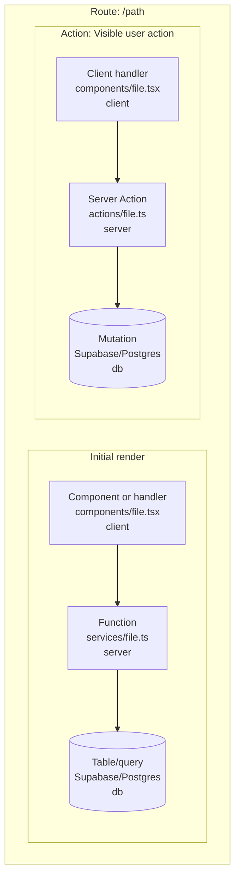

# Diagram schema

Use this stable shape for route maps:

Use HTML line breaks in Mermaid labels. Put source links and branch explanations below the diagram, where they do not make the visual dense.
